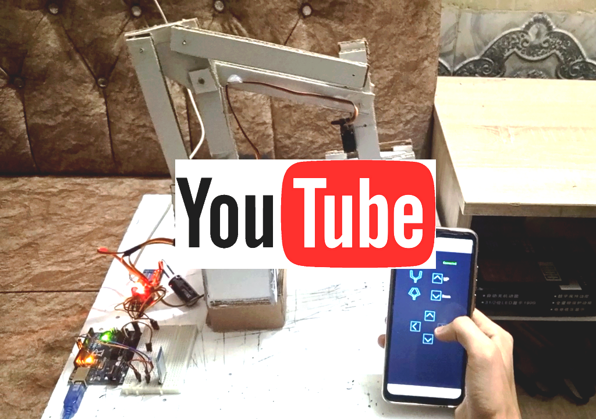
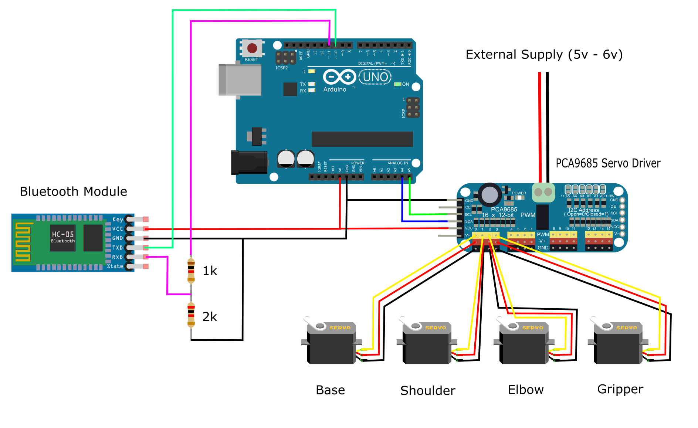
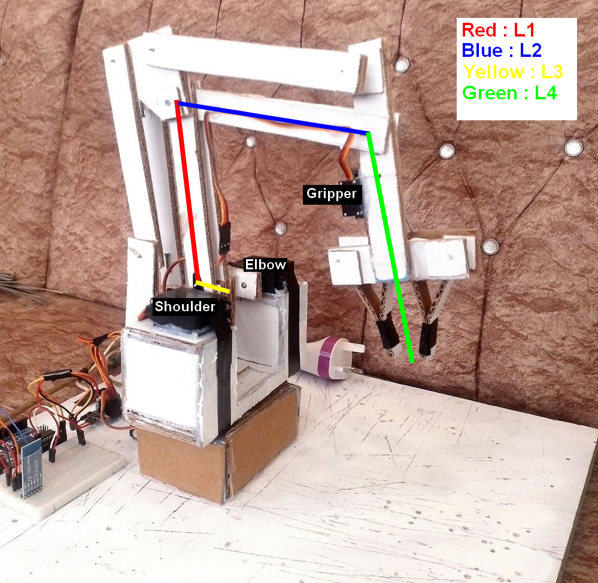

## AMK Robotic Arm

**Wireless Mobile-Controlled Robotic Arm** is a university project developed in 2024 at the **University of Baghdad, Department of Computer Engineering**.

The project is a robotic arm that can be controlled wirelessly using a mobile app. The app sends commands to an Arduino through Bluetooth, and the Arduino moves the arm's joints accordingly.

### How It Works

**Mobile App → Bluetooth → Arduino → Robotic Arm**

The mobile app was created using [MIT App Inventor](https://appinventor.mit.edu/), while the Arduino controls the arm's servo motors through a servo driver.

  
## Preview :
See the Robotic arm in action in the following video :  

[](https://drive.google.com/file/d/1ujAUz8KpqMgVOnT4MLJy1R0TG25h_lRZ/view?usp=drive_link)  

## Requirements :
**Hardware:**  
- Arduino Board.  
- HC-05 Bluetooth Module.  
- PCA9685 Servo Driver.  
- (4) Servo Motors.  
  
**Software:**  
- Arduino IDE.  
- [PCA9685 Servo Driver Library](https://github.com/adafruit/Adafruit-PWM-Servo-Driver-Library) for Arduino IDE.  
- Download the [pre-built APK](https://mega.nz/file/MAMg0BLA#8Wh_-gSblxILR6ScSU8lpUBLbq5XcLNQehBtzrp5560) app for android, or use [MIT App Inventor](https://appinventor.mit.edu/) to build ```Robotic_Arm.aia```.  

## Circuit Diagram :
  

## Arm Assembly :
  
  
## Acknowledgment
- Large part of inverse/forward kinematics maths used in this project were adapted from [This Github repository](https://github.com/yorkhackspace/meArm).  
- Special thanks to Dr. Asma and Brother Abdulrazaq, without them, I would never have known about robotic arms!  
