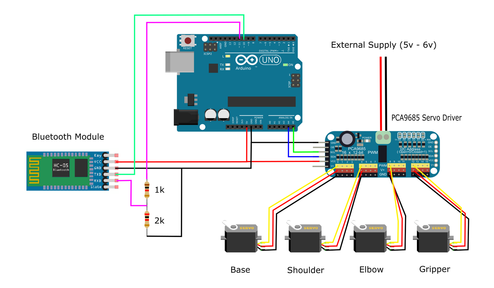

## AMK Robotic Arm
Wireless Mobile Controlled Robotic Arm.  
  
A Mobile App (programmed using [MIT App Inventor](https://appinventor.mit.edu/)) communicates with an **Arduino Board** through the HC-05 **Bluetooth Module**.
    
the **Arduino** controls the Joint's **(Servo Motors)** of the Robotic Arm through the PCA9685 **Servo Driver**.  

## Preview :
See the Robotic arm in action in the following video :  

  

## Requirements :
**Hardware:**  
- Arduino Board.  
- HC-05 Bluetooth Module.  
- PCA9685 Servo Driver.  
- (4) Servo Motors.  
  
**Software:**  
- Arduino IDE.  
- [PCA9685 Servo Driver Library](https://github.com/adafruit/Adafruit-PWM-Servo-Driver-Library) for Arduino IDE.  
- [MIT App Inventor](https://appinventor.mit.edu/)  

## Circuit Diagram :
  

## Assembly :
  